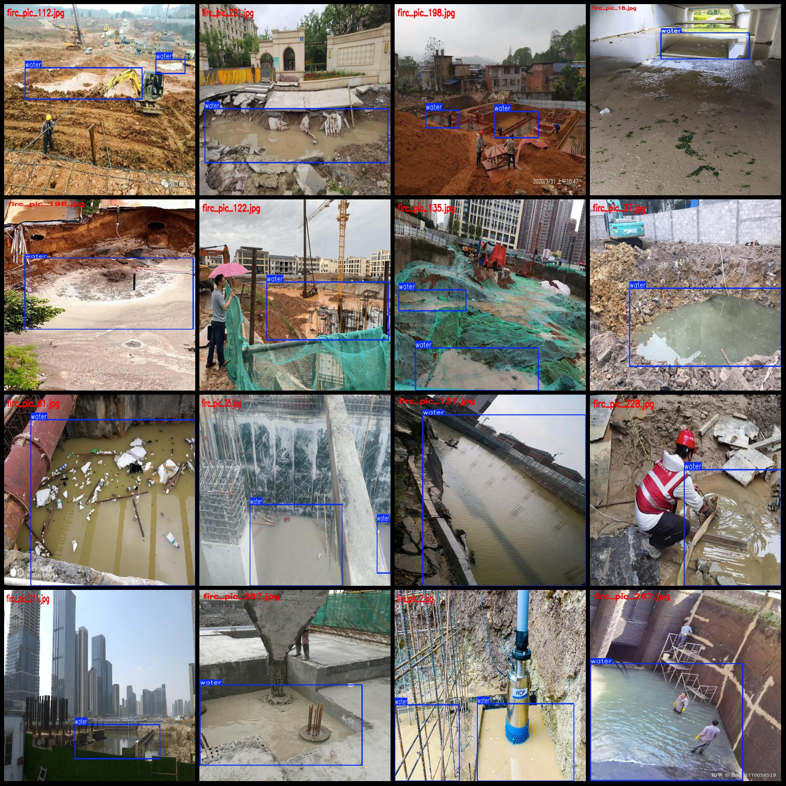
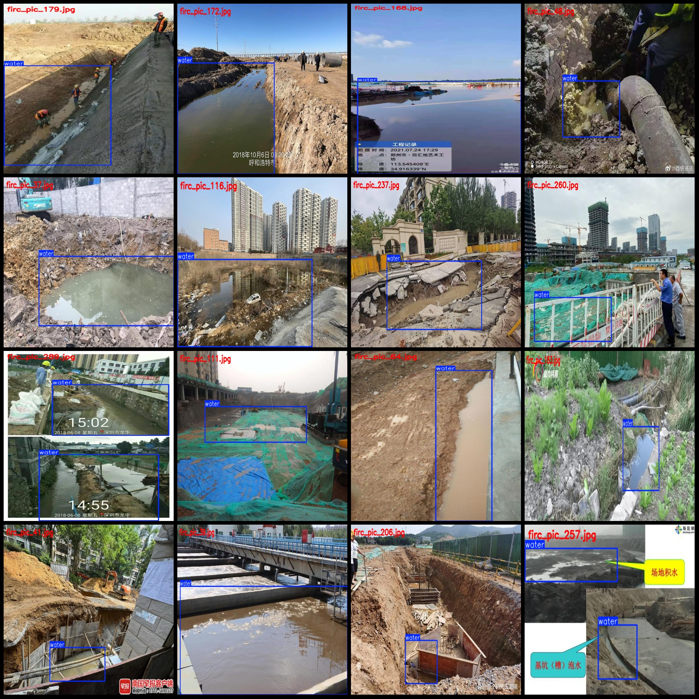

# Slope Water Pools Detection Data Set in VOC+YOLO format with 300 images per class

dataset format: Pascal VOC format + YOLO format (excluding split paths in txt files, only containing jpg images and corresponding VOC format xml files and yolo format txt files)

Number of images: 300
Number of labels: 300
Number of labels: 300
Number of label categories: 1
Label category name: ["water"]
Number of boxes per category:
Water boxes = 348
Total number of boxes: 348
Number of water images per category:
Water images = 300
Image resolution: Multi-resolution images, such as 667x500, 500x666, etc.
Labeling tool used: labelImg
Labeling rules: Draw rectangle boxes for each category
Important note: The dataset does not have separate training, validation, or test sets; they need to be manually divided.
Special declaration: This dataset does not guarantee the accuracy of the trained models or weight files.
Image preview:

Here is a pay link on Stripe ( https://buy.stripe.com/3cs8yP7sY87d0vu9AB ). Please contact me lonlonago@foxmail.com after funding $89, and I will send you a complete data files , thank you!

